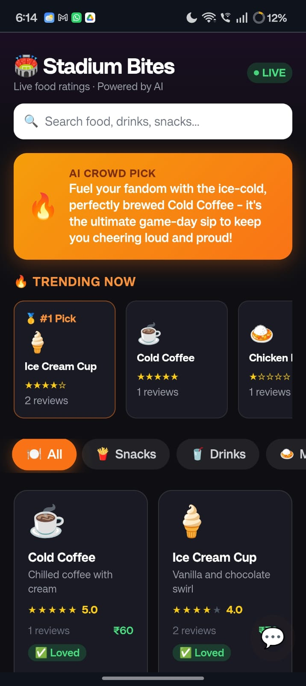
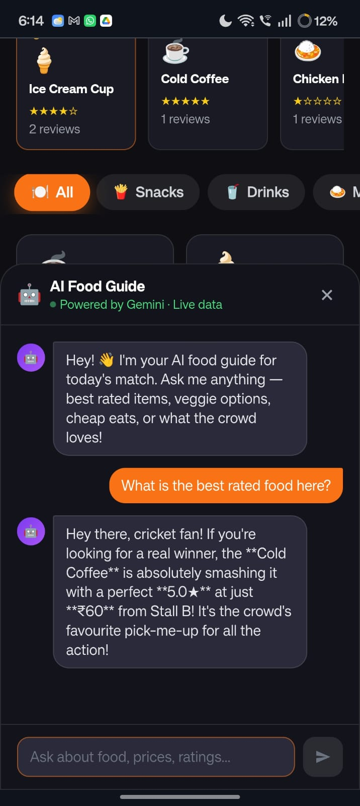
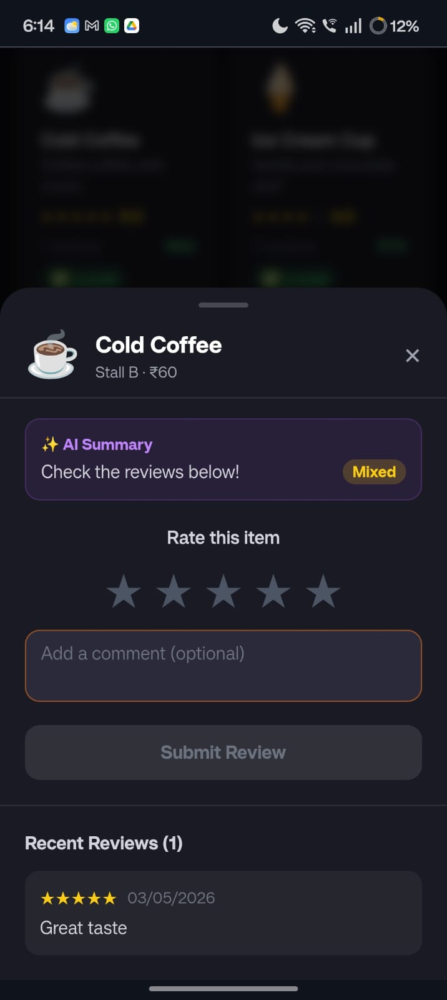
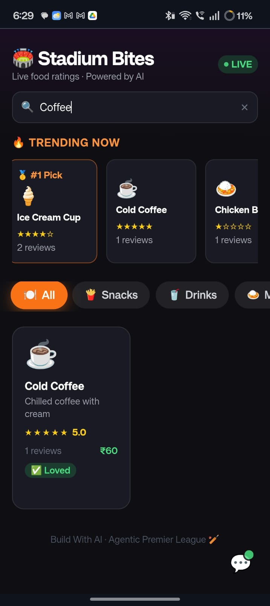

<div align="center">

# 🏟️ Stadium Bites

<br/>

**Never waste money on bad stadium food again.**  
Real-time crowd ratings + Gemini AI, built live at a hackathon in under 3 hours.

<br/>

<a href="https://stadium-bites.vercel.app" target="_blank" rel="noopener noreferrer">
  
</a>
&nbsp;
<a href="https://github.com/AvnishR4j/Stadium-Bites" target="_blank" rel="noopener noreferrer">
  
</a>

<br/>


</div>

---

## 🎬 Demo

<div align="center">

https://github.com/AvnishR4j/Stadium-Bites/raw/main/assets/demo.mp4

<br/>

### 🌐 Try it Live

<a href="https://stadium-bites.vercel.app" target="_blank" rel="noopener noreferrer">
  
</a>

</div>

---

## 📸 Screenshots

<div align="center">

| Home Screen | Trending & Categories | Food Detail | AI Chatbot |
|:-----------:|:--------------------:|:-----------:|:----------:|
|  |  |  |  |
| Live ratings grid + search bar | Trending picks + category filters | Star rating + AI review summary | Context-aware food guide |

</div>

---

## 🎯 The Problem

You're at a cricket stadium. It's the 15th over. You're hungry. There are 12 food stalls around you — and **you have no idea which one is actually good.**

You guess. You spend ₹200. It's terrible.

**Stadium Bites fixes this.**

---

## ✨ Features

<table>
<tr>
<td width="50%">

### 🔴 Live Crowd Ratings
Ratings update **in real-time** across every fan's phone the moment someone submits a review. Powered by Supabase Realtime — no refresh needed.

</td>
<td width="50%">

### 🤖 AI Review Summaries
Every food item gets a **Gemini-powered one-sentence verdict** from all crowd reviews — Loved, Mixed, or Avoid.

</td>
</tr>
<tr>
<td width="50%">

### 🔥 AI Crowd Pick Banner
Gemini reads the top-rated items and writes a **live hype recommendation** shown at the top of the app.

</td>
<td width="50%">

### 💬 AI Food Guide Chatbot
Ask anything in natural language and get answers powered by **live menu data + real crowd ratings**.

</td>
</tr>
<tr>
<td width="50%">

### 🔍 Instant Search
Filter across all food items by name or description — results update as you type.

</td>
<td width="50%">

### 🎊 Confetti on Submit
Because rating good food should feel rewarding. Confetti bursts on every review submission.

</td>
</tr>
</table>

---

## 🧠 AI Features Breakdown

```
┌─────────────────────────────────────────────────────────┐
│                    GEMINI AI LAYER                      │
├─────────────────┬──────────────────┬────────────────────┤
│  getCrowdPick() │ getAISummary()   │ getChatResponse()  │
│                 │                  │                    │
│  Reads top-5    │  Reads all       │  Multi-turn chat   │
│  rated items →  │  reviews for     │  with full menu    │
│  writes a hype  │  one item →      │  context + crowd   │
│  banner         │  sentiment +     │  ratings baked in  │
│  recommendation │  summary         │                    │
└─────────────────┴──────────────────┴────────────────────┘
       All calls include exponential backoff retry (429 safe)
```

---

## 🏗️ Architecture

```
Fan's Phone (React + Vite)
        │
        ├── Supabase PostgreSQL ──► food_items, reviews tables
        │        │
        │        └── Realtime Subscription ──► live updates to all clients
        │
        └── Google Gemini 2.5 Flash Lite
                 ├── Crowd Pick banner
                 ├── Per-item AI summaries
                 └── Chatbot with live menu data
```

---

## 🛠️ Tech Stack

| Layer | Technology | Why |
|-------|-----------|-----|
| Frontend | React 18 + Vite | Fast dev, instant HMR |
| Styling | Tailwind CSS v3 | Rapid dark-theme UI |
| Database | Supabase PostgreSQL | Free tier, instant setup |
| Realtime | Supabase Realtime | Live rating sync across clients |
| AI | Gemini 2.5 Flash Lite | Best free-tier model available |
| Animations | canvas-confetti + CSS | Delightful micro-interactions |
| Deployment | Vercel | Zero-config, instant deploys |

---

## 🚀 Run Locally

```bash
# 1. Clone
git clone https://github.com/AvnishR4j/Stadium-Bites.git
cd Stadium-Bites

# 2. Install dependencies
npm install

# 3. Add environment variables
touch .env.local
```

```env
VITE_SUPABASE_URL=your_supabase_url
VITE_SUPABASE_ANON_KEY=your_supabase_anon_key
VITE_GEMINI_KEY=your_gemini_api_key
```

```bash
# 4. Run
npm run dev
```

### Supabase Schema

```sql
create table food_items (
  id uuid primary key default gen_random_uuid(),
  name text, description text, category text,
  price int, image_emoji text, stall_name text,
  avg_rating numeric default 0,
  review_count int default 0
);

create table reviews (
  id uuid primary key default gen_random_uuid(),
  food_item_id uuid references food_items(id),
  rating int check (rating between 1 and 5),
  comment text,
  created_at timestamptz default now()
);
```

---

## 🏆 Hackathon

Built for **Agentic Premier League 2025** — Problem Statement 4: *AI-Powered Stadium Food Rating System*

> Built from scratch in under 3 hours ⚡

---

<div align="center">

### Made with ❤️ and 🏏 by Avnish Raj

*If you found this useful, drop a ⭐ on the repo!*

</div>
